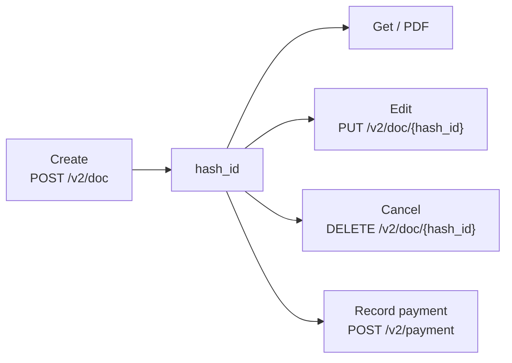

Documents are the core resource of the Swipe API. An invoice, a purchase, an estimate, a sales return — they're all documents, created through one endpoint and addressed by one identifier.

## The document model

Every document is created with [`POST /v2/doc`](/api-reference/document-v2/create-a-document). The `document_type` field decides what you're creating:

| `document_type`     | Use for                                              |
| ------------------- | ---------------------------------------------------- |
| `invoice`           | A standard GST sales invoice                         |
| `purchase`          | A purchase recorded against a vendor                 |
| `estimate`          | A quotation for a customer                           |
| `pro_forma_invoice` | A pro forma invoice sent before the real one         |
| `sales_return`      | Goods returned by a customer (credit note)           |
| `purchase_return`   | Goods returned to a vendor (debit note)              |
| `delivery_challan`  | Goods movement without a sale                        |
| `subscription`      | A recurring invoice — see [Subscriptions](/subscriptions) |

Sales-side documents take a `party` of type `customer`; purchase-side documents (`purchase`, `purchase_return`) take a `party` of type `vendor`.

## The document lifecycle



The `hash_id` returned on creation is the document's address for everything that follows — fetching it, editing it, cancelling it, downloading its PDF, generating an [e-way bill](/ewaybills) for it, or settling it with a [payment](/payment).

```json
{
  "success": true,
  "message": "Document created successfully",
  "data": {
    "hash_id": "PUlgCNPb",
    "serial_number": "INV-1"
  }
}
```

For a complete first request, follow the [Quickstart](/quickstart) — it creates an invoice and downloads its PDF in two calls.

## Things to know before you build

<Note>
    **Customers and products are auto-created.** The `party` and `items` in your
    payload carry your own IDs. If an ID is new, Swipe creates the record from
    the details you send; if it exists, the record is reused. See [API
    conventions](/api-conventions#ids-yours-and-swipes).
</Note>

- **Party updates propagate.** If you send changed details for an existing party ID, the party is updated — and existing documents linked to that party reflect the change.
- **Item details in a document don't update the catalog.** Sending different details for an existing item ID applies them to that document only; use [Update an item](/api-reference/product-v2/update-an-item) to change the master record.
- **Serial numbers must be unique.** Send your own `serial_number` (or `serial_number_v2`) and a retried create fails safely with `DUPLICATE_DOC_SERIAL_NUMBER` instead of duplicating the document.
- **Edits replace the document.** [Edit a document](/api-reference/document-v2/edit-a-document) expects the full payload with every field's updated value, not a partial diff.
- **E-invoices ride on creation.** Pass `einvoice: true` when creating to also generate a GST e-invoice with IRN and QR code — see [E-Invoices](/einvoices).

## Documents in the dashboard

Everything the API creates appears in the [Swipe dashboard](https://app.getswipe.in/list/sales) alongside documents made in the app — the invoice creation screen below works on the same data.

<Frame caption="The same invoice, as it looks in the Swipe dashboard">
    
</Frame>

## Endpoints

<CardGroup cols={2}>
    <Card title="Create a document" icon="plus" href="/api-reference/document-v2/create-a-document">
        The full payload — items, taxes, discounts, charges, export details.
    </Card>
    <Card title="Get a document" icon="magnifying-glass" href="/api-reference/document-v2/get-a-document">
        Fetch a document's details by `hash_id`.
    </Card>
    <Card title="Get document PDF" icon="file-pdf" href="/api-reference/document-v2/get-document-pdf">
        Download the rendered PDF.
    </Card>
    <Card title="Edit a document" icon="pen" href="/api-reference/document-v2/edit-a-document">
        Replace a document's contents by `hash_id`.
    </Card>
    <Card title="Cancel a document" icon="ban" href="/api-reference/document-v2/cancel-a-document">
        Cancel an active document.
    </Card>
    <Card title="List of documents" icon="list" href="/api-reference/document-v2/list-of-documents">
        List documents by type, date range, and payment status.
    </Card>
</CardGroup>
